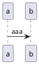

---
puppeteer:
  landscape: false
  format: "A4"
  margin:
    top: 15mm
    left: 15mm
    right: 15mm
    bottom: 10mm
  displayHeaderFooter: true
  headerTemplate: "<div style='font-size: 9px; margin-left: 5mm; margin-right: 5mm; position: relative; width: 100%; text-align: right; border-bottom: 1px solid black;'><span class='title'></span></div>"
  footerTemplate: "<div style='font-size: 9px; margin-left: 5mm; margin-right: 5mm; position: relative; width: 100%; text-align: center; border-top: 1px solid black;'><span class='pageNumber'></span> / <span class='totalPages'></span></div>"
  printBackground: true
id: my_id
class: "my-class1 my-class2"
---

<!-- @import "style.less" -->

# ドキュメント生産性向上のために {.title}

# 第 1 版 {.version}

# 株式会社　ビー・エス・エス {.author}

## 目次 {ignore=true}

<!-- @import "[TOC]" {cmd="toc" depthFrom=2 depthTo=2 orderedList=true} -->

<!-- code_chunk_output -->

1. [背景](#背景)
2. [課題](#課題)
3. [具体的なドキュメント作成環境](#具体的なドキュメント作成環境)
4. [サンプル](#サンプル)

<!-- /code_chunk_output -->

## 背景

開発業務においては、各種ドキュメントに基づき、作業を進める。
たとえば、プログラム実装では、詳細設計書やテーブル定義書などが必要となる。

また、開発業務では進捗が悪くなることは日常茶飯事であり、ドキュメントの修正を後回しにして、実装を優先させてしまう。

この状態（即ち、ドキュメントとソースファイルの乖離）が、次工程までに解消されない場合、生産性の低下を招いてしまう。
そして、往々にして、解消されない場合が多い。

この原因は、ドキュメントを修正した後に実装するという手順を遵守しない事にあるのは明白である。
しかしながら、多くの開発現場では、実装作業を急ぐあまり、ドキュメントの修正を後回しにしてしまっているのも、現実である。

その結果、ドキュメントは信用できず、

- ソースファイルを解析し仕様を確認する
- 解析に漏れが生じる
- 潜在的バグを仕様と誤解する
- 各工程、各担当者が、上記作業を重複して作業する

などにより、生産性の低下や、品質の低下を招いている

## 課題

開発業務における生産性向上と品質向上のために、ドキュメントとソースファイルの乖離を防ぐこと。

### ドキュメントの利用方法

ドキュメントとしての利用方法は、

- 納品物
- 決裁、承認の対象
- 仕様書
- 開発工程の前提資料

などである。
一般的には、いずれも作成後に変更はできない、あるいは変更しないものという位置づけと考えられている。（とくに、ウォーターフォールの場合、厳格に取り扱われる）

しかし、仕様書や開発工程の前提資料などは、その内容に変更は生じるものであり、その変更は関係者に周知されるべきものである。つまり、速やかにドキュメントに反映されるべきである。
そして、その変更は、履歴として残すことも重要である。

実は、ドキュメントの利用方法として、

- 作成の後、変更できてはならないドキュメント（以下、Complete 型ドキュメント）
- 使用していく中で、変更され、完成されるドキュメント（以下、Progress 型ドキュメント）

の二種類に分類できる。

### ドキュメントに必要な要素

- 表紙
- 改訂履歴
- 目次
- 見出し、本文
- ヘッダー、フッター
- 画像
- 表

### ドキュメントのファイル形式

#### ドキュメントは、なぜ Excel や Word なのか

多くの場合、ドキュメントは Excel や Word で作成されている。その理由として、

- 他に適切な編集用アプリケーションがないため
- 納品物として、他者（主に顧客）でも閲覧可能な形式である必要性
- 非開発者によって編集する場合もある
- Excel は、管理用途での集計などのため、開発業務に浸透している
- ワープロソフトとしては Word 以外にも選択肢はあるが、Excel とセットで導入されている場合がほとんどであり、余分なコストがかからない
- ドキュメントに必要な要素を扱うことができる

などが挙げられる。

つまり、Excel や Word によってドキュメントが作成されているのは、

- 多くの人、組織などで、閲覧、編集が可能である

からであり、そのファイル形式によるものではない。

#### Complete 型ドキュメントの場合

当然ながら、Excel や Word のように、編集可能なファイル形式を避けるべきである。
Excel や Word の場合、パスワードを付けるなどで、編集不能としている。

本来なら PDF を採用すべきではないだろうか。

なお、PDF として作成するためには、以下のように、いくつかの手段がある。

1. 直接 PDF ファイルを編集するのであれば、専用アプリケーションを使用する
2. PDF 形式として保存することが可能なアプリケーションを使用する
3. PDF 形式に変換可能なファイル形式で編集したのち、変換する

#### Progress 型ドキュメントの場合

変更しやすいことが求められる。もちろん、Excel や Word であっても支障はない。

しかし、主に変更するのは、設計者や開発者である。開発者はテキストエディターでのファイル編集作業は不可欠であり、また中心的でもある。その作業の途中で他のアプリケーションを使用することで、生産性が低下してしまう。

ファイル変更履歴管理は、ソースファイルの場合、Git や Subversion などを活用している。

ドキュメントについても、同様の管理方法とすることが好ましく、ソースファイルと同様に管理している場合多くなってきている。

ただ、Excel や Word のファイルは、これら変更履歴を管理するツールが苦手としているファイル形式である。たとえば、変更前後の差分を確認することは難しく、ディスク容量も消費する傾向にある。

したがって、テキスト形式を採用すべきではないだろうか。

## 具体的なドキュメント作成環境

|                    | Complete 型ドキュメント | Progress 型ドキュメント |
| ------------------ | :-----------------------: | :-----------------------: |
| 最終ファイル形式   | PDF                     | テキスト（Markdown）    |
| 作成中ファイル形式 | テキスト（Markdown）    | テキスト（Markdown）    |
| 変更履歴管理       | 要                      | 要                      |

| 必要アプリケーション                          | 用途                   |
| --------------------------------------------- | ---------------------- |
| テキストエディター（VS Code）                 | 編集                   |
| Markdown Preview Enhanced（VS Code 拡張機能） | PDF 変換、変換結果確認 |
| markdownlint（VS Code 拡張機能）              | Markdown 文法チェック  |
| Paste Image（VS Code 拡張機能）               | 画像ファイル張り付け   |
| PlantUML（VS Code 拡張機能）                  | 作図                   |
| PDF Preview（VS Code 拡張機能）               | PDF ファイル表示       |
| Java 実行環境                                 | 作図                   |
| Graphviz                                      | 作図                   |
| Google Chrome                                 | PDF 変換               |

## サンプル

### 画像（UML 図）

記述

````{.line-numbers}

````


### 画像（イメージ）


### 表（csv ファイルを表示）

<!-- textlint-disable -->

@import "勤務実績表.csv"

<!-- textlint-enable -->

### 表
